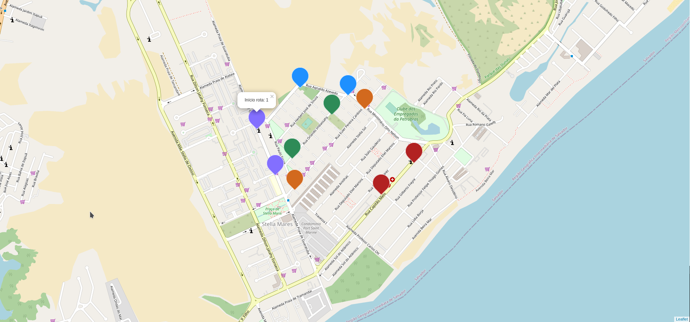

# Desafio 2 Imersão Full Cycle 2

## Informações do desafio 2
```
Nesse desafio você trabalhará com backend e frontend juntos para consolidar os conhecimentos adquiridos nas aulas de Nest.js e React.js.


Para isso:

- Crie um docker-compose.yaml que levante uma aplicação Nest.js e React juntos

- A aplicação Nest.js precisa rodar na porta 3000

- Aplicação React.js precisa rodar na porta 3001.

- Ao acessar http://localhost:3001 a aplicação React precisa consumir e listar "rotas" do endpoint do Nest.js: http://localhost:3000/routes.

- O endpoint http://localhost:3000/routes precisa retornar 5 rotas com os seguintes dados: title - título da rota, startPosition - contém latitude e longitude, endPosition - contém latitude e longitude
```

## Informações do desafio 3

```
Nesse desafio, você deverá gerar os manifestos yaml do Kubernetes (deployment e service) para o backend e o frontend que criados no desafio 2.


Você NÃO precisa utilizar um Cloud Provider como AWS, GCP e Azure para realizar essa tarefa. Você pode realizar localmente a instalação do cluster utilizando o Kind (https://kind.sigs.k8s.io/).
```

## Resultado

<p align="center">
  
</p>
